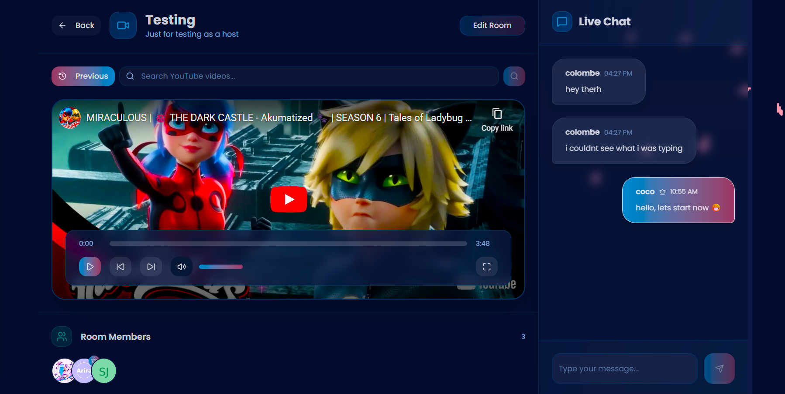

<div align="center">

<div style="display: flex; flex-direction: row; align-items: center; gap: 1rem; margin-bottom: 1rem;">
  
  <div>
    <h1 style="margin: 0;">KOKORO — Heart to Heart</h1>
  </div>
</div>

<p>A real-time space to chat and watch videos together with friends ✨</p>

<div align="center" style="margin-bottom: 1rem; margin-top: 1rem;">
  
  
  
  
  
  
  
  
  
  
  
  
  
</div>

</div>

## ✨ What is Kokoro?

Kokoro (心) means "heart" in Japanese, and that's exactly what this app is about - creating heartfelt connections through shared experiences.

Imagine watching your favorite YouTube videos with friends, chatting in real-time, and feeling like you're in the same room, even when you're miles apart. That's the magic of Kokoro 🌟

## 🎀 Beautiful Features

| Feature                                 | Description                                                                                                                        | Technology              |
| :-------------------------------------- | :--------------------------------------------------------------------------------------------------------------------------------- | :---------------------- |
| **Real-time Chat & Notifications** 💬🔔 | Instant messaging and live notifications—friend requests, room invites, and other events appear in real-time in other users’ feeds | Socket.io               |
| **Sync Video Playback** 🎥              | Watch YouTube videos together in perfect sync across users                                                                         | YouTube API + Socket.io |
| **Smart Forms** 📝                      | Type-safe form validation that just works                                                                                          | Zod + React Hook Form   |
| **Global State** 💾                     | Simple and powerful state management for app-wide consistency                                                                      | Zustand                 |
| **Secure Auth** 🔐                      | Easy login with Google, GitHub, and Facebook                                                                                       | BetterAuth              |

## 🚀 Quick Start

### Installation

1. **Clone with love**

   ```bash
   git clone https://github.com/yourusername/kokoro.git
   cd kokoro
   ```

2. **Install dependencies**

   ```bash
   npm install
   ```

3. **Environment Setup**

   ```bash
   # Copy our example environment file
   cp .env.example .env.local
   # Fill in your beautiful environment variables 💫
   ```

4. **Start creating magic**
   ```bash
   npm run dev
   ```
   Open [http://localhost:3000](http://localhost:3000) and watch the magic unfold!

## 📜 Scripts Guide

| Script Command         | Purpose                                   | When to Use                                  |
| :--------------------- | :---------------------------------------- | :------------------------------------------- |
| `npm run dev`          | Development server with Prisma generation | Daily development with hot reload            |
| `npm run build`        | Production build with Prisma generation   | Before deployment to Vercel                  |
| `npm run start`        | Start production server                   | After build to run optimized app             |
| `npm run build:socket` | **Full build with Socket.io server**      | Building both frontend and real-time backend |
| `npm run start:socket` | **Start Socket.io server**                | Running the real-time communication server   |
| `npm run generate:api` | Generate API client from OpenAPI specs    | When API specifications change               |

## 🖼️ App Preview

<div align="center">



</div>

## 🛠️ Deployment

Running smoothly on **Render** at `https://kokoro-backend.onrender.com` 🌊

For deployment, make sure to update all your API endpoints from `localhost` to your production backend URL in both your components and environment variables.

---

<div align="center">

### **Ready to create beautiful moments together?**

**Kokoro** · _Heart To Heart_ · 🌸✨🎀
</div>
